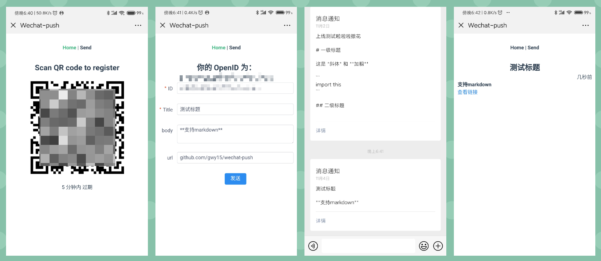

# Wechat-push
[](https://travis-ci.org/gwy15/wechat-push)


Wechat-push is a service that allows you push message to your smart phone using the Wechat MP platform.
Wechat-push uses python/aiohttp as backend and Vue as frontend.

Wechat-push 可以利用微信服务号向手机推送消息，如服务器报警等。
Wechat-push 使用 python 作为后端，Vue 作为前端界面。



## Usage | 使用方法

*Assume `https://your.domain.com/` is used as domain below.*

*以下假设你使用 `https://your.domain.com/` 作为域名。*

Wechat-push provides RESTful API.

Wechat-push 提供 RESTful API。

### Send a message | 发送消息
```
POST https://your.domain.com/message
data: {
    receiver: receiver open ID,
    title: message title,
    body (optional): message body (Markdown format),
    templateID (optional): template id to use,
    url (optional): url on the buttom of page. 
}
return:
    400 HTTPBadRequest for parameter errors
    200 OK: {
        errcode: Wechat errcode, 0 for success,
        errmsg: Wechat error message,
    }
```

### Receive a message | 接受消息

+ Visit `https://your.domain.com/` for open ID. 访问 `https://your.domain.com/` 扫码关注获取你的 open ID。
+ Pick up your phone and open Wechat. 手机打开微信。

## Deployment | 部署

Download [releases](https://github.com/gwy15/wechat-push/releases) and unzip to a path you like.

下载 [分发](https://github.com/gwy15/wechat-push/releases) 并解压到你喜欢的路径。

### Environment Setup | 环境设置

To deploy, users must setup their environment variables by editing the `.env` file.

部署前，需要设置一些环境变量。编辑 `.env` 文件。

```
# edit .env
APP_ID = XXXXXXXXXX # your wechat MP account app ID     | 微信服务号的APP ID
APP_SECRET = XXXXX  # your wechat MP account app Secret | 微信服务号的 APP SECRET
WECHAT_TOKEN = XXXX # your self defined wechat callback token | 微信服务号的回调 token

SQL_DB_URL = sqlite:///messages.sqlite3
REDIS_URL = redis://@localhost:1234/0       # optional.*

# full root url for front end page 前端根 url，需要填写完整 URL
VUE_APP_ROOT_URL = https://your.domain.com/
SERVER_API_ROOT = /
```

\* *scan-for-open-id doesn't work without redis.*

\* *若 REDIS_URL 无法连接，则无法使用扫码获得 Open ID 功能。*

### Nginx Setup | Nginx 设置

For nginx setup, see `config/your-site.conf`.

Nginx 设置参见 `config/your-site.conf`


### Wechat MP Setup | 微信服务号设置

Use [Test Account](https://mp.weixin.qq.com/debug/cgi-bin/sandboxinfo?t=sandbox/login) if you don't have a Service Account.

如果你没有微信服务号（公众号无法发送模板消息），使用 [测试账号](https://mp.weixin.qq.com/debug/cgi-bin/sandboxinfo?t=sandbox/login)。

Callback url*  回调 url*
```
https://your.domain.com/callback
```

\* Only ports 80/443 are acceptable for wechat.

\* 微信只接受 80/443 端口的回调，若公网无法访问这两个端口，可以发送消息但无法扫码获取 ID。

### Get Things Running Now! | 把服务跑起来！
Linux:
```
./wechat_xxxx.pex --port 1235
```

Windows:
```
python ./wechat_xxxx.pex --port 1235
```

## TODOS

- [x] Redis
- [x] Account Bind
- [x] Scan QR Page
- [x] Sender Page
- [ ] Scan Open ID Without Redis
- [ ] Threshold For IP And Receiver
